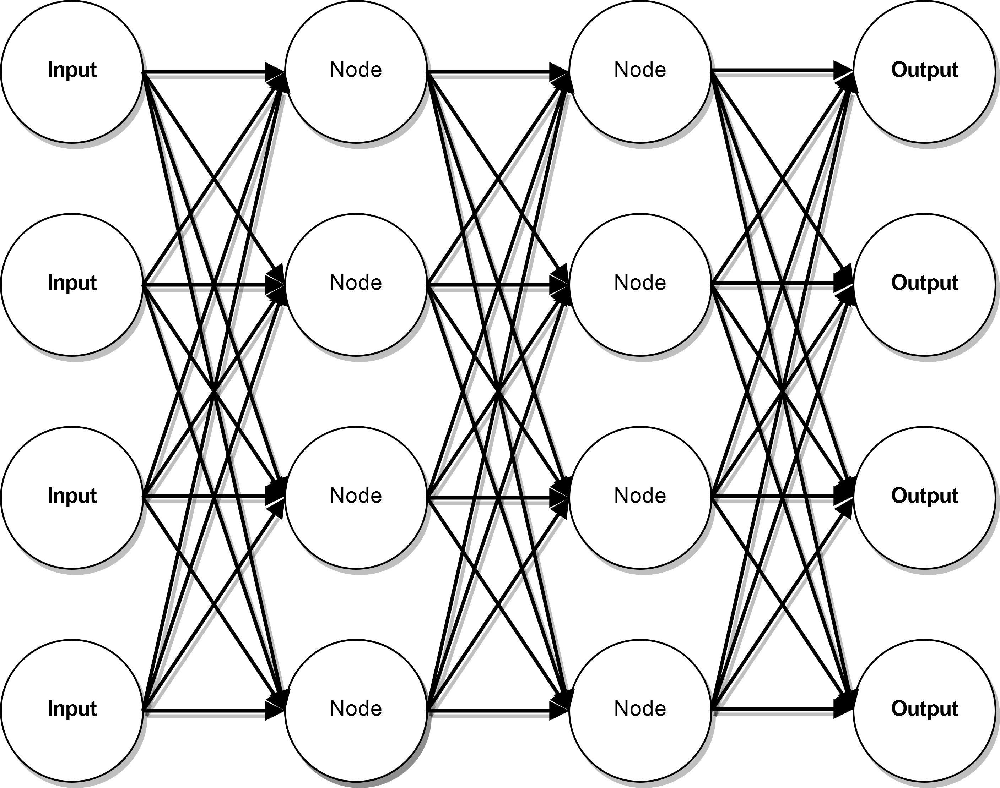

# Ai Graph

## Help

If you run into any issues or need help with using `ai-graph` in your project please email [incoming+efunb/ai-graph@incoming.gitlab.com](mailto:incoming+efunb/ai-graph@incoming.gitlab.com)

## How

In `ai-graph` an gene looks like this.

A gene takes a number of inputs each line takes a value from a node or an input the mutates it in some way.
Each node takes all the values from every line that goes into it to find its value.
The output nodes values are used as outputs from the gene.

## Downloads

[Docs](https://gitlab.com/efunb/ai-graph/-/jobs/artifacts/dev/download?job=docs)

## Dependencies

| Dependency | Version | Used for                                                           |
| :--------- | :-----: | -----------------------------------------------------------------: |
| rand       | 0.5     | Generating the random numbers used in the artificial intelligence. |
| rayon      | 1.0.2   | Parallel code.                                                     |
| chrono     | 0.4     | Store time generation was made.                                    |

## **Warning**

**If you are viewing this from GitHub then this is a read only copy. Please contribute to the GitLab copy [here](https://gitlab.com/efunb/ai-graph).**